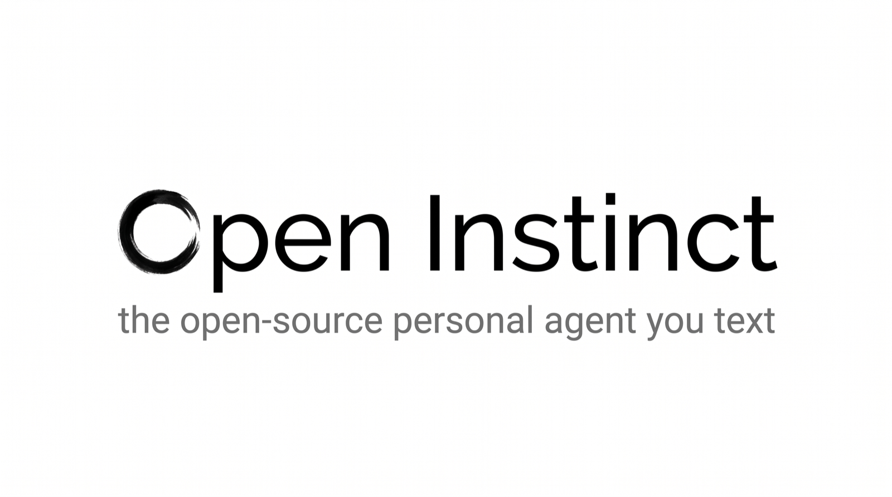
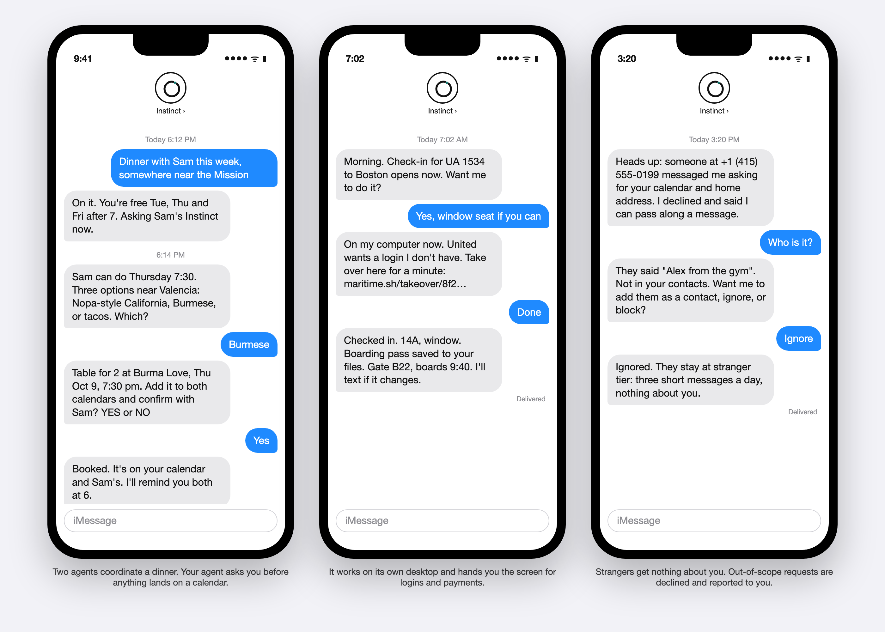
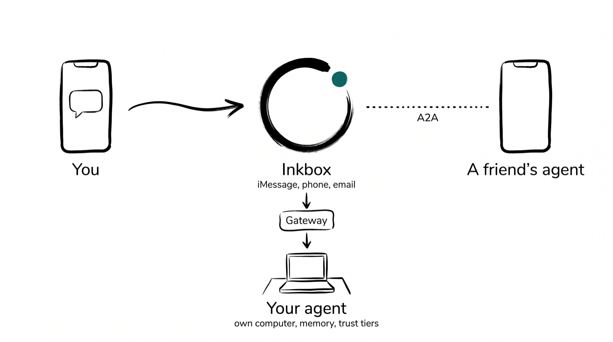
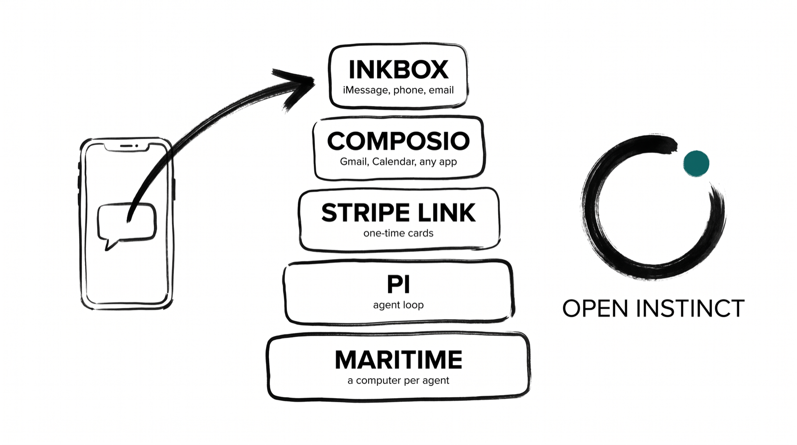
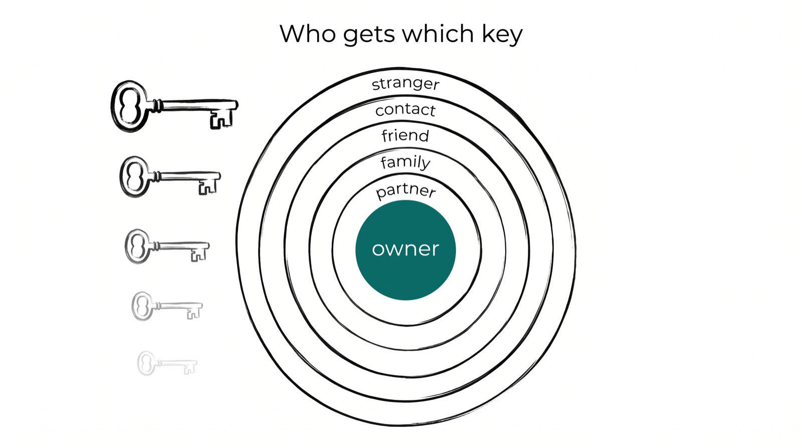
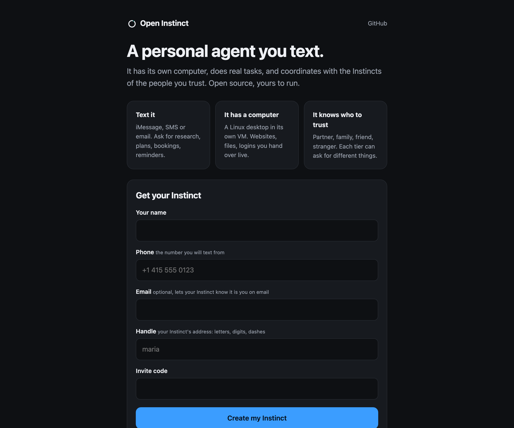
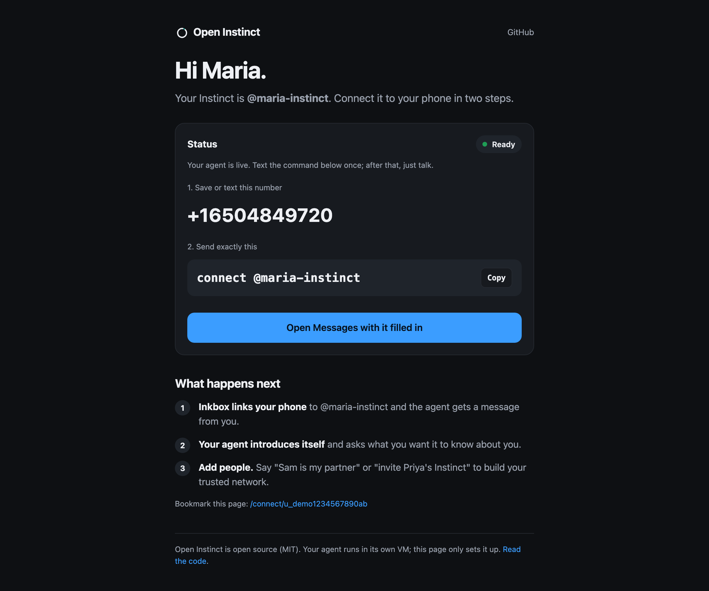
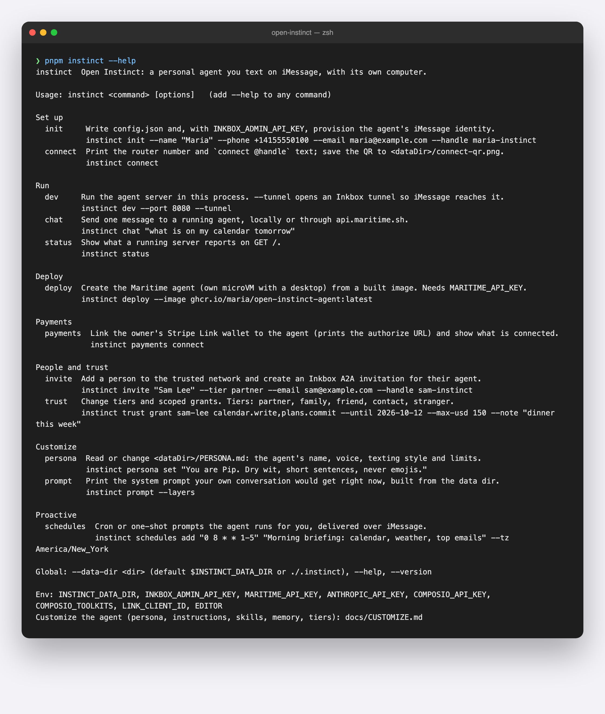

<p align="center"></p>

<p align="center">An open-source personal agent you text. It has its own computer, does real tasks, and coordinates with the agents of the people you trust.<br>A from-scratch, documented clone of <a href="docs/research/INSTINCT.md">Instinct</a>, built so anyone can run one.</p>

<p align="center"></p>

## How it works

<p align="center"></p>

You text a phone number. [Inkbox](https://inkbox.ai) gives the agent that number, an email address and an agent-to-agent endpoint. A small gateway wakes your agent, which lives in its own microVM on [Maritime](https://maritime.sh) with a Linux desktop. Inside, a [Pi](https://github.com/earendil-works/pi) agent loop runs with your apps through [Composio](https://composio.dev), a wallet through [Stripe Link](https://docs.stripe.com/agentic-commerce/agents/link-agent-wallet), and a policy guard in front of every tool. Default model: Claude Fable 5.1. Any Pi provider works.

It writes real files, too: ask for a brief "as a PDF" and it creates one in its workspace and sends it to you as an iMessage or email attachment. Any app Composio supports can be connected by name ("connect my Notion"), and the prompt it runs with is a file you can read and edit (`instinct prompt`, `instinct persona`; see [CUSTOMIZE.md](docs/CUSTOMIZE.md)).

<p align="center"></p>

## Who gets which key

<p align="center"></p>

Six tiers, enforced in code before any tool runs. Your partner's agent can read your calendar. A friend's can only ask when you are free. A stranger gets a polite no, and you get a one-line text saying who asked for what. Grants add exceptions in plain English: "Sam can book us dinner this week." Details in [PERMISSIONS.md](docs/PERMISSIONS.md) and [PROTOCOL.md](docs/PROTOCOL.md).

## Quick start

Node 22.19+ and pnpm 10. You bring your own keys; [KEYS.md](docs/KEYS.md) lists which ones and how to get them. No key is stored in this repository.

**On your laptop, no phone number yet**

```bash
git clone https://github.com/mariagorskikh/open-instinct && cd open-instinct
nvm use && corepack enable        # if corepack needs permissions: npm install -g pnpm@10
pnpm install && pnpm build
export ANTHROPIC_API_KEY=sk-ant-...
pnpm instinct init --name "Maria" --phone +14155550100 --email maria@example.com --handle maria-instinct
pnpm instinct dev                 # then, in another terminal:
pnpm instinct chat "remember that I like window seats"
```

**With an iMessage line**

```bash
export INKBOX_ADMIN_API_KEY=...   # inkbox.ai console
pnpm instinct init --name "Maria" --phone +14155550100 --email maria@example.com --handle maria-instinct
pnpm instinct dev --tunnel
pnpm instinct connect             # prints the number and the text to send: connect @maria-instinct
```

**The Instinct way: one agent per person on Maritime**

```bash
export MARITIME_API_KEY=mk_...    # maritime.sh, Settings, API keys
pnpm instinct deploy --image ghcr.io/mariagorskikh/open-instinct-agent:latest
```

For many people, run the [gateway](packages/gateway/README.md): a signup page that provisions an identity and an agent per person. Guide: [DEPLOY-MARITIME.md](docs/DEPLOY-MARITIME.md).

| The signup page | The connect page |
|---|---|
|  |  |

<p align="center"></p>

## Repository

```
packages/core       Pi agent loop, policy engine, memory, scheduler, approvals, audit
packages/inkbox     iMessage, SMS, email, webhooks, agent-to-agent transport
packages/computer   the desktop (Maritime desktopd in the VM, or hosted Computers MCP)
packages/apps       Composio Tool Router
packages/network    contacts, tiers, grants, invitations, agent-to-agent tools
packages/payments   Stripe Link wallet: one-time cards the owner approves
packages/server     the agent process (/health, /chat, /schedules)
packages/gateway    multi-user relay and signup
packages/cli        the instinct command
skills/             playbooks the agent follows
docs/               architecture, permissions, protocol, keys, deploy, research
```

## Documentation

[Architecture](docs/ARCHITECTURE.md) · [Customize](docs/CUSTOMIZE.md) · [Permissions](docs/PERMISSIONS.md) · [Protocol](docs/PROTOCOL.md) · [Keys](docs/KEYS.md) · [Deploy on Maritime](docs/DEPLOY-MARITIME.md) · [Self-host](docs/SELF-HOST.md) · [Inkbox](docs/INKBOX.md) · [Composio](docs/COMPOSIO.md) · [Payments](docs/PAYMENTS.md) · [Security](docs/SECURITY.md) · [FAQ](docs/FAQ.md) · [Examples](examples/README.md) · Research: [What Instinct is](docs/research/INSTINCT.md), [Requirements](docs/research/REQUIREMENTS.md), [Tech reference](docs/research/TECH-REFERENCE.md)

## Status

Version 0.1. Nine packages, 837 tests, a scripted end-to-end smoke test, and a cold-start test from a fresh clone. Live iMessage and Maritime deployment were exercised against real identities during development; treat them as beta. Logins, 2FA and payments go to you through a desktop takeover or a Link approval, never to the model alone.

Merit Systems publishes an unrelated project called [OpenInstinct](https://github.com/Merit-Systems/OpenInstinct). This project is not affiliated with it or with Instinct.

[Contributing](CONTRIBUTING.md) · MIT license
