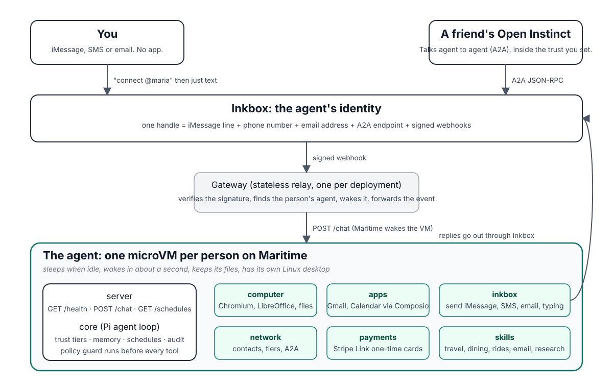
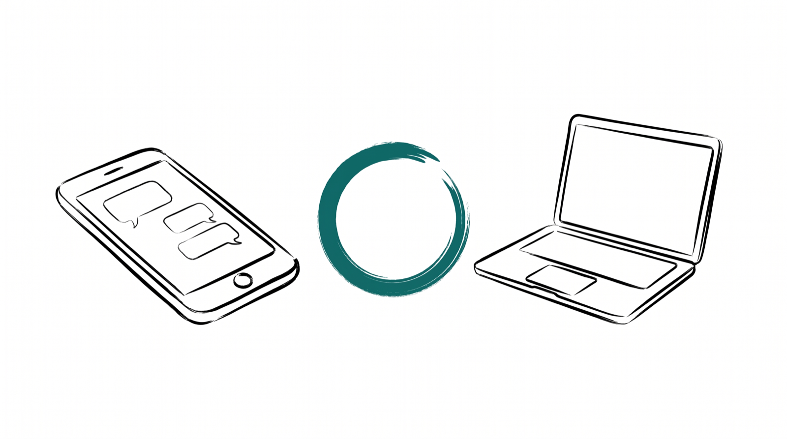
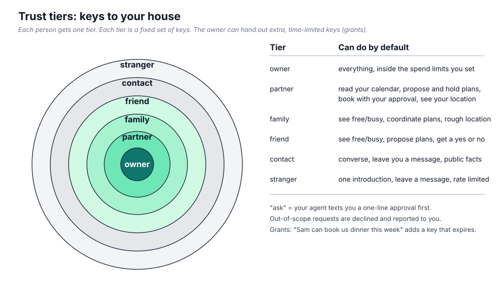

<p align="center"></p>

# Open Instinct

An open-source personal agent you text. It lives on its own computer, does real tasks for you, and coordinates with the agents of the people you trust. It is a from-scratch, documented clone of [Instinct](docs/research/INSTINCT.md), the invite-only personal agent that raised $1B in September 2026, built so anyone can run one.

You text it on iMessage. It books the table, moves the meeting, checks you into the flight, researches the thing, and texts you back. Your partner's Open Instinct can see your calendar. A friend's can only ask when you are free. A stranger's can leave a message. You decide who gets which key.

**Name.** Merit Systems publishes an unrelated project called [OpenInstinct](https://github.com/Merit-Systems/OpenInstinct). This project is Open Instinct (two words, npm scope `@open-instinct/*`). It is not affiliated with Merit Systems or with Instinct.

<p align="center"></p>

## What it does

| You text | It does |
|---|---|
| "Dinner with Sam this week, somewhere near the Mission" | Checks your calendar, asks Sam's Open Instinct for free evenings, proposes up to 3 slots, books once you say yes, confirms with Sam's agent |
| "Check me in for tomorrow's flight" | Opens the airline site on its desktop, asks you to take over for the login once, saves the boarding pass to your files |
| "What's in my inbox that needs me today?" | Reads Gmail through Composio, sends a 5-line brief, drafts the two replies, sends nothing until you approve |
| "Buy the socks in my cart" | Gets the checkout to a final total, asks Link for a one-time card for that exact amount, waits for you to approve in Link, types the card in |
| "Text me every morning at 7 with my day" | Creates a schedule; Maritime wakes it at 6:59 even though it slept all night |
| "Sam is my partner" | Moves Sam to the partner tier: calendar read, bookings with your approval, location |

<p align="center"></p>

## What it looks like

<p align="center"></p>

<sub>Mock conversations rendered from <a href="docs/assets/mock/imessage.html">docs/assets/mock/imessage.html</a>; the wording is what the agent's skills tell it to say.</sub>

| The signup page (gateway) | The connect page |
|---|---|
|  |  |

<p align="center"></p>

## Why this exists

Instinct showed that a personal agent should be a phone number, not an app, and that agents coordinating with other people's agents is the interesting part. It is closed, invite-only and holds your data. Open Instinct keeps the product shape and opens the box: the model is yours to pick, the permission table is a JSON file with tests, the memory is Markdown you can read, and every side effect is in an audit log you can ask about in chat.

## Building blocks

| Block | What it does here | Note |
|---|---|---|
| [Pi](https://github.com/earendil-works/pi) (`@earendil-works/pi-agent-core`, `pi-ai`, `pi-coding-agent`, `pi-mcp`) | The agent loop, tool hooks, model catalog, sessions and MCP client | Pi is the framework OpenClaw was originally built on. OpenClaw now ships its own `@openclaw/agent-core` and keeps only `pi-tui`. Open Instinct uses Pi directly. See [the tech reference](docs/research/TECH-REFERENCE.md). |
| [Inkbox](https://inkbox.ai) | The agent's identity: one handle gives it an iMessage line, a phone number, an email address and an A2A endpoint | [packages/inkbox](packages/inkbox/README.md) |
| [Maritime](https://maritime.sh) | The agent's home: one Firecracker microVM per person with a persistent Linux desktop, asleep when idle, awake in about a second | [packages/computer](packages/computer/README.md), [packages/cli](packages/cli/README.md) |
| [Composio](https://composio.dev) | The keyring: one Tool Router session per person for Gmail, Google Calendar, Contacts and 1000+ other apps, with per-user OAuth | [packages/apps](packages/apps/README.md) |
| [Stripe Link Agent Wallet](https://docs.stripe.com/agentic-commerce/agents/link-agent-wallet) | The wallet: the owner approves each purchase in Link, the agent gets a one-time card for that amount | [packages/payments](packages/payments/README.md) |
| Claude Fable 5.1 | The default model | Any provider in Pi's catalog works, including OpenAI-compatible proxies |

## Quick start

Three ways to run it. All need Node 22.19 or newer and pnpm 10. You bring your own keys; [docs/KEYS.md](docs/KEYS.md) lists which ones each setup needs and how to get them. No key is ever stored in this repository.

### 1. Try it locally (no phone number yet)

```bash
git clone https://github.com/mariagorskikh/open-instinct && cd open-instinct
nvm use                       # Node 22.20 from .nvmrc
corepack enable               # if this needs permissions, run: npm install -g pnpm@10
pnpm install && pnpm build    # a warning about a missing bin before the first build is harmless
export ANTHROPIC_API_KEY=sk-ant-...
pnpm instinct init --name "Maria" --phone +14155550100 --email maria@example.com --handle maria-instinct
pnpm instinct dev
# in another terminal
pnpm instinct chat "remember that I like window seats"
```

Without Inkbox keys the agent still runs. Replies to iMessage-shaped events go to its console. `pnpm instinct chat` talks to it over HTTP on `127.0.0.1:8080`.

### 2. Give it an iMessage line (Inkbox)

```bash
export INKBOX_ADMIN_API_KEY=...        # from https://inkbox.ai/console
pnpm instinct init --name "Maria" --phone +14155550100 --email maria@example.com --handle maria-instinct
pnpm instinct dev --tunnel             # opens an Inkbox tunnel so webhooks reach your laptop
pnpm instinct connect                  # prints the router number and the text to send: connect @maria-instinct
```

Text the connect command from your iPhone. Your agent answers on iMessage.

### 3. Run it the Instinct way (Maritime, one agent per person)

```bash
export MARITIME_API_KEY=mk_...         # https://maritime.sh, Settings, API keys
pnpm instinct deploy --image ghcr.io/mariagorskikh/open-instinct-agent:latest
```

For many users, run the [gateway](packages/gateway/README.md): a signup page that provisions an Inkbox identity and a Maritime agent per person and relays their messages. For a local trial of both images, `docker compose -f deploy/docker-compose.yml up --build` (see [deploy/.env.example](deploy/.env.example)).

### Optional pieces

| Set | And the agent gets |
|---|---|
| `COMPOSIO_API_KEY` | Gmail, Google Calendar and Contacts tools (`COMPOSIO_TOOLKITS` picks the toolkits) |
| `LINK_CLIENT_ID`, `LINK_CLIENT_SECRET`, `STRIPE_PUBLISHABLE_KEY` | The Stripe Link wallet and the `payment_*` tools |
| `INSTINCT_CHAT_TOKEN` | A bearer token on the owner's HTTP surface (`/chat`, `/status`, `/schedules`) |
| `BRAVE_SEARCH_API_KEY` | Better web search; DuckDuckGo otherwise |

The full list is in [deploy/.env.example](deploy/.env.example) and [docs/ARCHITECTURE.md](docs/ARCHITECTURE.md#configuration).

## The trusted network

<p align="center"></p>

Six tiers, one table, enforced in code before any tool runs:

| | owner | partner | family | friend | contact | stranger |
|---|---|---|---|---|---|---|
| see free/busy | yes | yes | yes | yes | no | no |
| read calendar | yes | yes | no | no | no | no |
| book for you | yes | ask | ask | ask | no | no |
| spend money | limit | ask | no | no | no | no |
| your location | exact | exact | approx | no | no | no |
| leave you a message | - | yes | yes | yes | yes | 3/day |

"Ask" means your agent texts you a one-line approval. Grants add scoped exceptions in plain English ("Sam can book us dinner this week"). The table is enforced twice: a request the policy refuses gets a polite no, and you get a one-line text saying who asked for what. Two agents talk over [A2A](docs/PROTOCOL.md) with a typed intent so a dinner takes four messages, not forty. Details: [docs/PERMISSIONS.md](docs/PERMISSIONS.md).

## Repository

```
packages/core       agent runtime: Pi loop, policy engine, memory, scheduler, approvals, audit, types
packages/inkbox     iMessage, SMS, email, webhooks, A2A transport
packages/computer   the desktop (Maritime desktopd in the VM, or hosted Computers MCP)
packages/apps       Composio Tool Router
packages/network    contacts, tiers, grants, invitations, agent-to-agent tools
packages/payments   Stripe Link agent wallet: one-time cards the owner approves
packages/server     the agent process (Maritime BYO contract: /health, /chat, /schedules)
packages/gateway    multi-user relay and signup
packages/cli        the `instinct` command
skills/             playbooks the agent follows (travel, dining, rides, scheduling, …)
examples/           three runnable examples (chat loop, signed fake webhook, two agents over A2A)
deploy/             Dockerfile.agent, Dockerfile.gateway, docker-compose.yml, entrypoint.sh, Maritime patch, .env.example
.github/workflows/  build-images.yml publishes both images to GHCR
docs/               architecture, permissions, protocol, build brief, research
```

## Documentation

- [Architecture](docs/ARCHITECTURE.md): how the pieces fit, message flow, tools, state on disk, configuration
- [Permissions](docs/PERMISSIONS.md): tiers, capabilities, grants, spend policy, approvals, the twice-enforced guard
- [Protocol](docs/PROTOCOL.md): how two agents coordinate (OIP/1 over A2A), group plans
- [Keys](docs/KEYS.md): which accounts and keys you need, how to get them, how to swap providers
- [Build brief](docs/BUILD-BRIEF.md): the exact library facts implementers need
- [Examples](examples/README.md): run the pieces without a phone, a VM or an API key
- Package guides: [cli](packages/cli/README.md) · [server](packages/server/README.md) · [gateway](packages/gateway/README.md) · [inkbox](packages/inkbox/README.md) · [computer](packages/computer/README.md) · [apps](packages/apps/README.md) · [network](packages/network/README.md) · [payments](packages/payments/README.md) · [skills](skills/README.md)
- Research: [What Instinct is](docs/research/INSTINCT.md) · [Requirements](docs/research/REQUIREMENTS.md) · [Tech reference](docs/research/TECH-REFERENCE.md)

## Status

Version 0.1, nine packages. On 2026-10-03, `pnpm -r test` runs 725 vitest tests in 56 files, all passing:

| Package | Tests | Package | Tests |
|---|---|---|---|
| core | 183 | cli | 64 |
| inkbox | 93 | network | 62 |
| apps | 82 | gateway | 52 |
| server | 80 | computer | 43 |
| payments | 66 | | |

`pnpm smoke` boots a real agent with Pi's faux model and walks four flows over HTTP: the owner storing a preference, a stranger's iMessage, a schedule, and a stranger's agent asking for the calendar over A2A (declined, owner told once). None of this needs network access or keys.

What the tests do not cover: live iMessage through Inkbox and live Maritime deployment were exercised against real identities during development, but there is no automated test for them; treat them as beta. The payments package is tested against a stubbed Link client. The desktop tools are tested against a scripted desktopd and an in-memory MCP server. Logins, 2FA and CAPTCHAs always go to a human through `request_takeover`; there is no code path that solves a CAPTCHA.

## Contributing

Read [CONTRIBUTING.md](CONTRIBUTING.md). Run `pnpm check` (build, tests, smoke) before a pull request. Keep prose short and plain.

## License

MIT.
